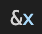
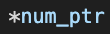
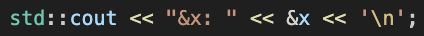
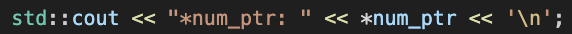

# Pointers

Practicing the use of pointers.

## Tools

* Languages: C++

## Information

The "&" is used to dereference a variable as follows:

The "*" is used to dereference a pointer as follows:

We can then print their respective values as follows:

